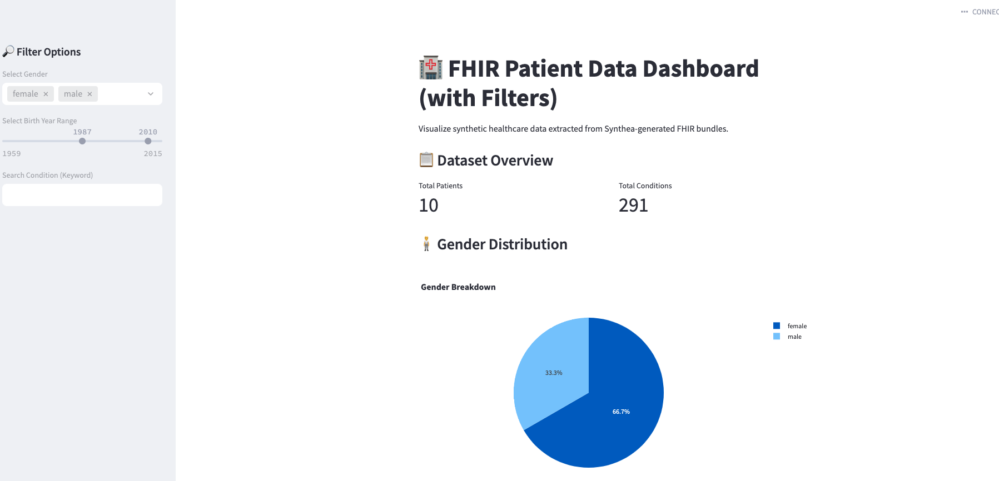

# 🏥 Healthcare FHIR Data Pipeline Project

This project demonstrates a complete data engineering workflow for synthetic healthcare records using **FHIR (Fast Healthcare Interoperability Resources)** data generated by [Synthea](https://github.com/synthetichealth/synthea). It includes parsing, cleaning, structuring, and storing patient data in both **CSV and SQLite formats**, visualizing it with **Streamlit**, and connecting it to **Looker Studio** for cloud-based dashboards.

---

## 🚀 Project Features

✅ Extracts key healthcare data from FHIR JSON bundles  
✅ Parses and saves structured CSVs for each resource:  
&nbsp;&nbsp;&nbsp;&nbsp;📄 `Patient`, 🩺 `Condition`, 🏥 `Encounter`, 🔬 `Observation`  
✅ Loads data into a local SQLite database (`fhir_data.db`)  
✅ Query samples via `query_sqlite.py`  
✅ Interactive dashboard built using Streamlit  
✅ Cloud dashboard-ready for Looker Studio  
✅ Organized, modular scripts and documentation

---

## 📂 Project Structure

```
healthcare-FHIR-data-pipeline/
│
├── scripts/
│   ├── patients_parser.py            # Extract Patient data
│   ├── condition_parser.py           # Extract Condition data
│   ├── encounter_parser.py           # Extract Encounter data
│   ├── observation_parser.py         # Extract Observation data
│   ├── load_to_sqlite.py             # Load CSVs into SQLite
│   ├── query_sqlite.py               # Run SQL queries on the DB
│   ├── dashboard_app.py              # Streamlit app (basic)
│   └── dashboard_app_with_filters.py # Streamlit app with filters
│
├── data/
│   └── output/
│       ├── parsed_patients.csv
│       ├── parsed_conditions.csv
│       ├── parsed_encounters.csv
│       ├── parsed_observations.csv
│       └── fhir_data.db              # SQLite database
│
├── requirements.txt
├── README.md
└── fhir_pipeline_diagram.png
```

---

## 🛠 Setup Instructions

1. **Install dependencies**

```bash
pip install -r requirements.txt
```

2. **Place your FHIR `.json` files from Synthea** in:
```
/data/
```

3. **Run the parsers**

```bash
cd scripts/
python patients_parser.py
python condition_parser.py
python encounter_parser.py
python observation_parser.py
```

4. **Load to SQLite**

```bash
python load_to_sqlite.py
```

5. **Run sample queries**

```bash
python query_sqlite.py
```

6. **Launch the Streamlit Dashboard**

```bash
streamlit run dashboard_app_with_filters.py
```

---

## 📊 Visual Dashboard Options

### ✅ Local Interactive Dashboard (Streamlit)

A web-based Python dashboard with filters:
- Filter by gender
- Filter by birth year range
- Filter condition keyword
- See pie charts, bar charts, histograms

📄 File: `dashboard_app_with_filters.py`

### ✅ Cloud Dashboard (Looker Studio)

You can export your CSVs to **Google Sheets** or **BigQuery**, and build interactive cloud dashboards in Looker Studio.

---

## 🧠 Sample SQL Queries

```sql
-- All female patients
SELECT * FROM patients WHERE Gender = 'female';

-- Active conditions
SELECT * FROM conditions WHERE "Clinical Status" = 'active';

-- Most recent encounters
SELECT * FROM encounters ORDER BY "Start Time" DESC LIMIT 5;
```

---

## 📈 Technologies Used

- Python
- Pandas, SQLite, Requests, JSON, BeautifulSoup
- Google Sheets API (gspread, oauth2client)
- Streamlit + Plotly (for dashboards)
- Looker Studio / BigQuery (optional cloud analytics)
- SQLite3 (local relational database)
- dotenv, tabulate

---

## 📘 Visual Diagram

🔗 Live Demos (Codespaces Preview Links)  
- Basic Dashboard: [Streamlit App #1](https://probable-carnival-7wwr7r9xv9j2vgv-8501.app.github.dev/)  
- Dashboard with Filters: [Streamlit App #2](https://probable-carnival-7wwr7r9xv9j2vgv-8502.app.github.dev/) 

---

## 👩‍💻 Author

**Bita Ashoori**  
Freelance & Enterprise Data Engineer  
📫 [LinkedIn](https://www.linkedin.com/in/bashoori) • 🌐 [GitHub Portfolio](https://github.com/bashoori)
